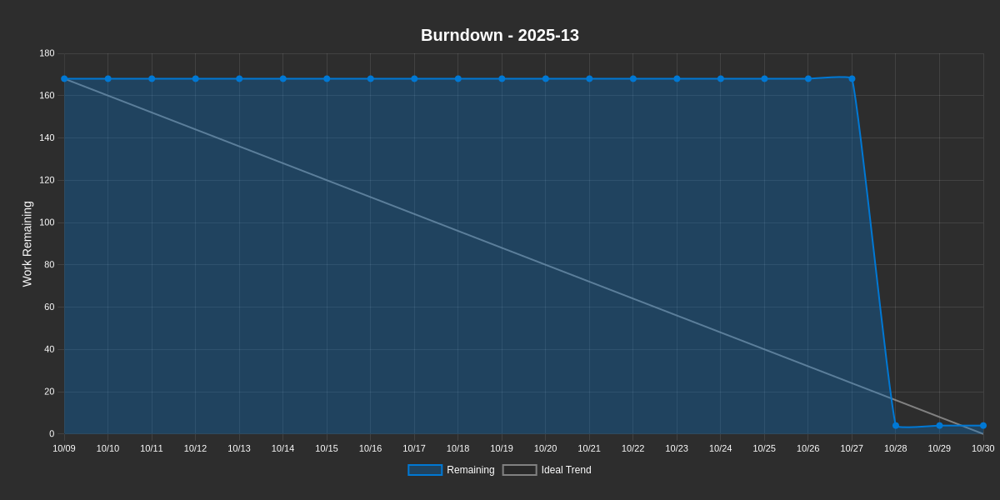
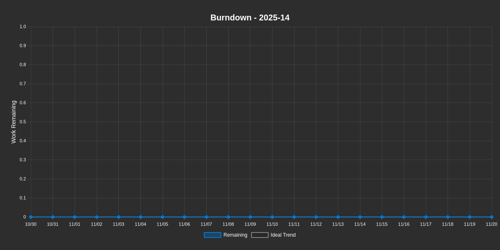

# Burndown Report

**Generated:** 2025-10-28 at 14:04:48 UTC

**Project:** [TEMPLATE] EngageMe

---

## 2025-13

<table>
<tr>
<td><strong>Remaining Work</strong> 2h</td>
<td><strong>Completed</strong> 99%</td>
<td><strong>Average Burndown</strong> 8.3h/day</td>
<td><strong>Total Scope</strong> 168h</td>
</tr>
</table>

**Duration:** 2025-10-09 to 2025-10-30 (21 days)  
**Progress:** Day 20 of 21 (2 days remaining)

### Burndown Chart

### Metrics

| Metric | Value |
|--------|-------|
| **Issues Closed** | 0 / 2 |
| **Projected Completion** | 1 days (✅ On Track) |

<strong>View All Issues (2)</strong>

| # | Title | Type | State | Estimate | Remaining | Completed |
|---|-------|------|-------|----------|-----------|----------|
| 🔵 #17 | [EPIC]  apic | Unknown | OPEN | 0h | 0h | 0h |
| 🔵 #19 | [Task] tasssssk | Unknown | OPEN | 168h | 2h | 166h |

---

## 2025-14

<table>
<tr>
<td><strong>Remaining Work</strong> 0h</td>
<td><strong>Completed</strong> 0%</td>
<td><strong>Average Burndown</strong> 0h/day</td>
<td><strong>Total Scope</strong> 0h</td>
</tr>
</table>

**Duration:** 2025-10-30 to 2025-11-20 (21 days)  
**Progress:** Day 0 of 21 (23 days remaining)

### Burndown Chart

### Metrics

| Metric | Value |
|--------|-------|
| **Issues Closed** | 0 / 0 |

<strong>View All Issues (0)</strong>

| # | Title | Type | State | Estimate | Remaining | Completed |
|---|-------|------|-------|----------|-----------|----------|

---

## 2025-15

<table>
<tr>
<td><strong>Remaining Work</strong> 0h</td>
<td><strong>Completed</strong> 0%</td>
<td><strong>Average Burndown</strong> 0h/day</td>
<td><strong>Total Scope</strong> 0h</td>
</tr>
</table>

**Duration:** 2025-11-20 to 2025-12-11 (21 days)  
**Progress:** Day 0 of 21 (44 days remaining)

### Burndown Chart

### Metrics

| Metric | Value |
|--------|-------|
| **Issues Closed** | 0 / 0 |

<strong>View All Issues (0)</strong>

| # | Title | Type | State | Estimate | Remaining | Completed |
|---|-------|------|-------|----------|-----------|----------|

---

## 2025-16

<table>
<tr>
<td><strong>Remaining Work</strong> 0h</td>
<td><strong>Completed</strong> 0%</td>
<td><strong>Average Burndown</strong> 0h/day</td>
<td><strong>Total Scope</strong> 0h</td>
</tr>
</table>

**Duration:** 2025-12-11 to 2026-01-01 (21 days)  
**Progress:** Day 0 of 21 (65 days remaining)

### Burndown Chart

### Metrics

| Metric | Value |
|--------|-------|
| **Issues Closed** | 0 / 0 |

<strong>View All Issues (0)</strong>

| # | Title | Type | State | Estimate | Remaining | Completed |
|---|-------|------|-------|----------|-----------|----------|

---

*This report is automatically generated daily by GitHub Actions.*
