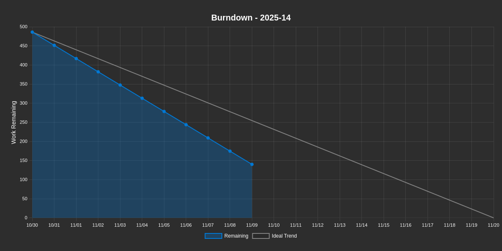

# Burndown Report

**Generated:** 2025-11-11 at 01:57:47 UTC

**Project:** [TEMPLATE] EngageMe

---

## 2025-14

<table>
<tr>
<td><strong>Remaining Work</strong> 140h</td>
<td><strong>Completed</strong> 71%</td>
<td><strong>Average Burndown</strong> 26.6h/day</td>
<td><strong>Total Scope</strong> 486h</td>
</tr>
</table>

**Duration:** 2025-10-30 to 2025-11-20 (21 days)  
**Progress:** Day 13 of 21 (9 days remaining)

### Burndown Chart

### Metrics

| Metric | Value |
|--------|-------|
| **Issues Closed** | 0 / 16 |
| **Projected Completion** | 6 days (✅ On Track) |

<strong>View All Issues (16)</strong>

| # | Title | Type | State | Estimate | Remaining | Completed |
|---|-------|------|-------|----------|-----------|----------|
| 🔵 #25 | [EPIC]  epic 3 | Unknown | OPEN | 50h | 0h | 50h |
| 🔵 #26 | [FEATURE] feature 3 | Unknown | OPEN | 50h | 0h | 50h |
| 🔵 #27 | [EPIC] epic 4 | Unknown | OPEN | 50h | 2h | 48h |
| 🔵 #30 | [EPIC] epic 6 | Unknown | OPEN | 0h | 0h | 0h |
| 🔵 #32 | [EPIC]  epic 7 | Unknown | OPEN | 0h | 0h | 0h |
| 🔵 #34 | [FEATURE] fæture 7.1 | Unknown | OPEN | 0h | 0h | 0h |
| 🔵 #36 | [EPIC] epic 8 | Unknown | OPEN | 0h | 0h | 0h |
| 🔵 #42 | [EPIC] asbest 3.0? | Unknown | OPEN | 50h | 20h | 30h |
| 🔵 #43 | [FEATURE] kraken | Unknown | OPEN | 50h | 20h | 30h |
| 🔵 #44 | [Task] streger på fortorvet | Unknown | OPEN | 50h | 20h | 30h |
| 🔵 #45 | [EPIC]  Forest Whitaker | Unknown | OPEN | 62h | 26h | 36h |
| 🔵 #46 | [FEATURE] Michael Caine | Unknown | OPEN | 62h | 26h | 36h |
| 🔵 #47 | [Task] Clint Eastwood | Unknown | OPEN | 50h | 20h | 30h |
| 🔵 #48 | [Task] Gary Oldman | Unknown | OPEN | 12h | 6h | 6h |
| 🔵 #49 | [EPIC]  Epic 7/11 | Unknown | OPEN | 0h | 0h | 0h |
| 🔵 #50 | [FEATURE] Feature 7/11 | Unknown | OPEN | 0h | 0h | 0h |

---

## 2025-15

<table>
<tr>
<td><strong>Remaining Work</strong> 0h</td>
<td><strong>Completed</strong> 0%</td>
<td><strong>Average Burndown</strong> 0h/day</td>
<td><strong>Total Scope</strong> 0h</td>
</tr>
</table>

**Duration:** 2025-11-20 to 2025-12-11 (21 days)  
**Progress:** Day 0 of 21 (30 days remaining)

### Metrics

| Metric | Value |
|--------|-------|
| **Issues Closed** | 0 / 0 |

<strong>View All Issues (0)</strong>

| # | Title | Type | State | Estimate | Remaining | Completed |
|---|-------|------|-------|----------|-----------|----------|

---

## 2025-16

<table>
<tr>
<td><strong>Remaining Work</strong> 0h</td>
<td><strong>Completed</strong> 0%</td>
<td><strong>Average Burndown</strong> 0h/day</td>
<td><strong>Total Scope</strong> 0h</td>
</tr>
</table>

**Duration:** 2025-12-11 to 2026-01-01 (21 days)  
**Progress:** Day 0 of 21 (51 days remaining)

### Metrics

| Metric | Value |
|--------|-------|
| **Issues Closed** | 0 / 0 |

<strong>View All Issues (0)</strong>

| # | Title | Type | State | Estimate | Remaining | Completed |
|---|-------|------|-------|----------|-----------|----------|

---

*This report is automatically generated daily by GitHub Actions.*
